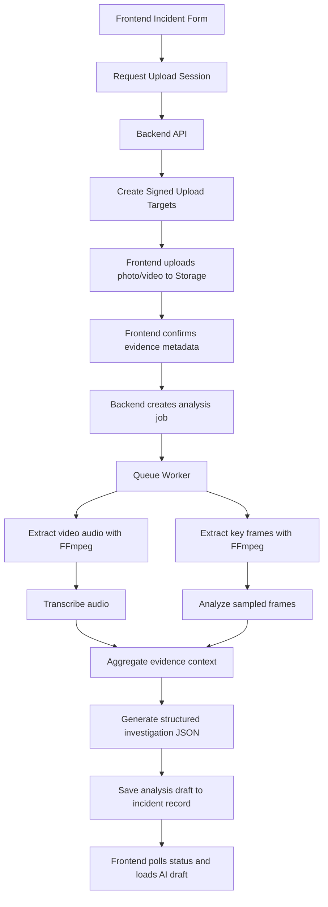

# Incident AI Video Investigation Backend Spec

## Goal

Add a secure backend service that can analyze incident photos and videos to produce an AI-assisted draft investigation for:

- Incident timeline summary
- Visible hazards and unsafe conditions
- Equipment condition observations
- Immediate causes
- Contributing factors
- Draft 5-Why chain
- Draft fishbone inputs
- Draft root cause statement
- Draft CAPA suggestions
- Confidence flags and missing-information prompts

This service must support the current frontend incident module without breaking the existing Firebase-based app.

## Scope For Phase 1

Phase 1 is limited to the `Incidents` module only.

Included:

- Photo upload
- Video upload
- Audio extraction from video
- Key-frame extraction from video
- Audio transcription
- Image/frame analysis
- Aggregated AI-assisted incident investigation draft
- Async job processing and status polling

Excluded from Phase 1:

- Real-time live video analysis
- Cross-module AI automation
- Final auto-closure decisions
- Automatic CAPA publishing without human review

## Key Design Principles

- Backend only. No OpenAI API calls from the browser.
- Async processing. Video analysis must run as a job.
- Human in the loop. Output is always a draft, never final truth.
- Traceable. Save prompts, model versions, timestamps, and job results.
- Replaceable. AI provider and model choices must be configurable.

## Recommended Stack

- API framework: `NestJS` with `TypeScript`
- Hosting: `Cloud Run`
- Auth and org access: `Firebase Admin SDK`
- File storage: `Firebase Storage` or `Google Cloud Storage`
- Queue/background jobs: `Cloud Tasks` or `Pub/Sub`
- Media processing: `FFmpeg`
- Database of record: current `Firebase Realtime Database`
- AI APIs:
  - Audio transcription: `gpt-4o-transcribe` or `gpt-4o-mini-transcribe`
  - Vision analysis: configurable vision-capable Responses model

## Why This Backend Pattern

OpenAI’s current official guidance is:

- Use image inputs for visual analysis through the Responses API
- Use the transcription API for audio
- For video, extract frames and analyze them rather than sending raw video directly

Reference links:

- [Images and vision](https://developers.openai.com/api/docs/guides/images-vision)
- [Speech to text](https://platform.openai.com/docs/guides/speech-to-text)
- [Video understanding cookbook](https://developers.openai.com/cookbook/examples/gpt_with_vision_for_video_understanding)

## High-Level Flow



## Backend Module Structure

Suggested project structure:

```txt
backend/
  src/
    main.ts
    app.module.ts
    modules/
      health/
      auth/
      incidents/
        incidents.module.ts
        controllers/
          incident-ai.controller.ts
        services/
          incident-ai.service.ts
          incident-evidence.service.ts
          incident-analysis-orchestrator.service.ts
          incident-analysis-persistence.service.ts
        dto/
          create-upload-session.dto.ts
          confirm-evidence.dto.ts
          request-analysis.dto.ts
          analysis-status.dto.ts
      media/
        media.module.ts
        services/
          ffmpeg.service.ts
          frame-extraction.service.ts
          audio-extraction.service.ts
          storage.service.ts
      ai/
        ai.module.ts
        services/
          openai-transcription.service.ts
          openai-vision.service.ts
          investigation-drafting.service.ts
        prompts/
          incident-analysis.prompt.ts
      jobs/
        jobs.module.ts
        workers/
          incident-analysis.worker.ts
      audit/
        audit.module.ts
        services/
          audit-log.service.ts
      shared/
        guards/
        interceptors/
        utils/
    infrastructure/
      firebase-admin/
      queue/
      config/
```

## Backend Responsibilities By Module

### `auth`

- Verify Firebase ID token
- Resolve org, role, site scope
- Reject users outside incident access

### `incidents`

- Create upload sessions
- Confirm uploaded evidence
- Start AI analysis jobs
- Expose status and results
- Save final AI draft back to incident record

### `media`

- Validate mime types and max sizes
- Store original files
- Extract audio and frames with FFmpeg
- Generate thumbnails

### `ai`

- Transcribe extracted audio
- Analyze incident photos and video frames
- Build a single structured incident investigation draft

### `jobs`

- Run long video analysis in the background
- Retry transient failures
- Update job status

### `audit`

- Log who started analysis
- Log provider/model used
- Log job duration and failures

## Storage Design

### Raw Evidence

Suggested object paths:

```txt
orgs/{orgId}/incidents/{incidentId}/evidence/photo-original.jpg
orgs/{orgId}/incidents/{incidentId}/evidence/video-original.mp4
orgs/{orgId}/incidents/{incidentId}/derived/audio-track.m4a
orgs/{orgId}/incidents/{incidentId}/derived/frame-0001.jpg
orgs/{orgId}/incidents/{incidentId}/derived/frame-0002.jpg
orgs/{orgId}/incidents/{incidentId}/derived/frame-contact-sheet.jpg
```

### Incident Record Additions

Suggested Firebase Realtime Database structure:

```json
{
  "aiEvidence": {
    "photo": {
      "storagePath": "orgs/org123/incidents/inc456/evidence/photo-original.jpg",
      "fileName": "scene-photo.jpg",
      "mimeType": "image/jpeg",
      "uploadedAt": "2026-05-17T18:30:00.000Z"
    },
    "video": {
      "storagePath": "orgs/org123/incidents/inc456/evidence/video-original.mp4",
      "fileName": "incident-walkthrough.mp4",
      "mimeType": "video/mp4",
      "uploadedAt": "2026-05-17T18:31:00.000Z",
      "durationSeconds": 42
    },
    "notes": "Visible oil leak under pump and missing barrier tape."
  },
  "aiAnalysis": {
    "status": "completed",
    "jobId": "job_01JXYZ",
    "startedAt": "2026-05-17T18:32:00.000Z",
    "completedAt": "2026-05-17T18:33:10.000Z",
    "provider": "openai",
    "transcriptionModel": "gpt-4o-transcribe",
    "visionModel": "gpt-4.1-mini",
    "draft": {
      "eventSummary": "",
      "visibleHazards": [],
      "immediateCauses": [],
      "contributingFactors": [],
      "fiveWhys": [],
      "fishbone": {
        "man": [],
        "machine": [],
        "material": [],
        "method": [],
        "environment": []
      },
      "rootCause": "",
      "capa": [],
      "confidence": "medium",
      "missingInformation": []
    },
    "review": {
      "status": "pending",
      "reviewedBy": "",
      "reviewedAt": ""
    },
    "failure": {
      "code": "",
      "message": ""
    }
  }
}
```

## API Contract

Base path:

```txt
/api/v1
```

Authentication:

- `Authorization: Bearer <firebase_id_token>`
- All endpoints are authenticated and org-scoped

### 1. Create Upload Session

`POST /api/v1/incidents/{incidentId}/ai-evidence/upload-session`

Purpose:

- Create signed upload targets for photo and optional video

Request:

```json
{
  "photo": {
    "fileName": "scene-photo.jpg",
    "mimeType": "image/jpeg",
    "sizeBytes": 2481221
  },
  "video": {
    "fileName": "incident-walkthrough.mp4",
    "mimeType": "video/mp4",
    "sizeBytes": 18440122
  }
}
```

Response:

```json
{
  "incidentId": "inc_001",
  "uploadSessionId": "upl_01JXYZ",
  "photo": {
    "storagePath": "orgs/org123/incidents/inc_001/evidence/photo-original.jpg",
    "uploadUrl": "https://storage-upload-url",
    "headers": {
      "Content-Type": "image/jpeg"
    }
  },
  "video": {
    "storagePath": "orgs/org123/incidents/inc_001/evidence/video-original.mp4",
    "uploadUrl": "https://storage-upload-url",
    "headers": {
      "Content-Type": "video/mp4"
    }
  },
  "expiresAt": "2026-05-17T19:00:00.000Z"
}
```

### 2. Confirm Uploaded Evidence

`POST /api/v1/incidents/{incidentId}/ai-evidence/confirm`

Purpose:

- Confirm successful upload and store metadata

Request:

```json
{
  "uploadSessionId": "upl_01JXYZ",
  "photo": {
    "storagePath": "orgs/org123/incidents/inc_001/evidence/photo-original.jpg",
    "fileName": "scene-photo.jpg",
    "mimeType": "image/jpeg"
  },
  "video": {
    "storagePath": "orgs/org123/incidents/inc_001/evidence/video-original.mp4",
    "fileName": "incident-walkthrough.mp4",
    "mimeType": "video/mp4"
  },
  "notes": "Visible leak near motor and skid marks near walkway."
}
```

Response:

```json
{
  "incidentId": "inc_001",
  "evidenceStatus": "confirmed",
  "photoAttached": true,
  "videoAttached": true
}
```

### 3. Start Smart Investigation

`POST /api/v1/incidents/{incidentId}/ai-analysis`

Purpose:

- Start the async AI investigation pipeline

Request:

```json
{
  "forceRerun": false,
  "includeVideo": true,
  "includeAudioTranscript": true,
  "frameSampleSeconds": 2,
  "maxFrames": 18,
  "analysisLanguage": "en",
  "incidentContext": {
    "title": "Forklift leak and slip near loading bay",
    "description": "Operator reported hydraulic leak and one worker slipped nearby.",
    "equipmentInvolved": "Forklift FLT-07",
    "immediateAction": "Area isolated and spill kit used.",
    "smartCategory": "Workplace Transport / Vehicles",
    "severity": "Level B",
    "type": "First Aid injury"
  }
}
```

Response:

```json
{
  "incidentId": "inc_001",
  "jobId": "job_01JXYZ",
  "status": "queued"
}
```

### 4. Analysis Status

`GET /api/v1/incidents/{incidentId}/ai-analysis/status`

Response:

```json
{
  "incidentId": "inc_001",
  "jobId": "job_01JXYZ",
  "status": "processing",
  "stage": "vision-analysis",
  "progressPercent": 68,
  "startedAt": "2026-05-17T18:32:00.000Z",
  "updatedAt": "2026-05-17T18:32:45.000Z"
}
```

Allowed `status` values:

- `queued`
- `processing`
- `completed`
- `failed`
- `cancelled`

Suggested `stage` values:

- `queued`
- `validating`
- `extracting-audio`
- `extracting-frames`
- `transcribing`
- `vision-analysis`
- `drafting-investigation`
- `persisting`
- `completed`

### 5. Get Analysis Result

`GET /api/v1/incidents/{incidentId}/ai-analysis`

Response:

```json
{
  "incidentId": "inc_001",
  "status": "completed",
  "provider": "openai",
  "transcriptionModel": "gpt-4o-transcribe",
  "visionModel": "gpt-4.1-mini",
  "transcript": {
    "text": "We found the leak under the hydraulic line and cordoned the area.",
    "segments": [
      {
        "startMs": 0,
        "endMs": 2400,
        "speaker": "speaker_1",
        "text": "We found the leak under the hydraulic line."
      }
    ]
  },
  "draft": {
    "eventSummary": "Hydraulic leakage from a forklift created a slip hazard in the loading area.",
    "visibleHazards": [
      "Fluid visible on floor near forklift",
      "Potential pedestrian exposure in transit path"
    ],
    "equipmentCondition": [
      "Visible leak near hydraulic line",
      "Housekeeping control applied after event"
    ],
    "immediateCauses": [
      "Leak created slip exposure",
      "Hazard existed in active movement zone"
    ],
    "contributingFactors": [
      "Equipment integrity issue",
      "Barrier/isolation control absent before event"
    ],
    "fiveWhys": [
      "Why 1: Worker slipped because hydraulic fluid was on the walking surface.",
      "Why 2: Fluid escaped from the forklift hydraulic line.",
      "Why 3: The component condition was degraded or failed under service.",
      "Why 4: Inspection or maintenance controls did not prevent the condition.",
      "Why 5: Preventive maintenance and hazard isolation controls were insufficient."
    ],
    "fishbone": {
      "man": ["Worker entered active hazard zone"],
      "machine": ["Hydraulic system leakage"],
      "material": ["Hydraulic fluid on floor surface"],
      "method": ["Isolation and defect response not in place before event"],
      "environment": ["Shared traffic and walking area"]
    },
    "rootCause": "Failure to prevent and isolate equipment fluid leakage in a shared pedestrian and vehicle operating area.",
    "capa": [
      {
        "act": "Inspect and repair the forklift hydraulic system before return to service",
        "priority": "high"
      },
      {
        "act": "Review pre-use inspection controls for hydraulic leaks",
        "priority": "medium"
      }
    ],
    "confidence": "medium",
    "missingInformation": [
      "Exact failure point not confirmed",
      "No maintenance record reviewed yet"
    ]
  },
  "review": {
    "status": "pending"
  }
}
```

### 6. Retry Analysis

`POST /api/v1/incidents/{incidentId}/ai-analysis/retry`

Request:

```json
{
  "reason": "Transcript quality poor in original run",
  "override": {
    "frameSampleSeconds": 1,
    "maxFrames": 24
  }
}
```

Response:

```json
{
  "incidentId": "inc_001",
  "jobId": "job_01JXYZ_retry_2",
  "status": "queued"
}
```

## OpenAI Prompting Strategy

The backend should use three separate AI stages:

### Stage A: Audio Transcription

Input:

- Extracted audio file
- Incident title and domain prompt

Output:

- Transcript text
- Optional diarization if needed

### Stage B: Frame-Level Vision Review

Input:

- Selected frame set
- Incident title
- Initial incident description
- Evidence observations typed by the user

Output:

- Scene summary
- Noted hazards
- Equipment observations
- Environmental conditions
- Uncertainty flags

### Stage C: Investigation Draft

Input:

- Incident form data
- Transcript
- Vision findings
- Evidence notes

Output:

- Strict JSON draft investigation

The final drafting prompt must explicitly instruct the model:

- do not invent facts not supported by evidence
- separate confirmed observations from hypotheses
- mark uncertainty when evidence is weak
- return structured JSON only

## Queue and Job Design

Each analysis request creates one job record:

```json
{
  "jobId": "job_01JXYZ",
  "orgId": "org123",
  "incidentId": "inc_001",
  "type": "incident-ai-analysis",
  "status": "queued",
  "stage": "queued",
  "attempt": 1,
  "createdBy": "user_123",
  "createdAt": "2026-05-17T18:32:00.000Z",
  "updatedAt": "2026-05-17T18:32:00.000Z"
}
```

Retry policy:

- max attempts: `3`
- retry on:
  - temporary storage failure
  - OpenAI timeout
  - queue processing interruption
- do not retry on:
  - invalid mime type
  - unsupported file
  - missing incident scope

## File Constraints

Recommended limits for Phase 1:

- photo max: `10 MB`
- video max: `100 MB`
- accepted photo types: `jpg`, `jpeg`, `png`, `webp`
- accepted video types: `mp4`, `mov`, `webm`
- max analysis duration per video: `120 seconds`

If larger:

- accept upload
- trim or reject for analysis depending on policy

## Suggested Environment Variables

```env
OPENAI_API_KEY=
OPENAI_TRANSCRIPTION_MODEL=gpt-4o-transcribe
OPENAI_VISION_MODEL=gpt-4.1-mini
INCIDENT_AI_MAX_VIDEO_MB=100
INCIDENT_AI_MAX_FRAMES=18
INCIDENT_AI_FRAME_SAMPLE_SECONDS=2
INCIDENT_AI_ANALYSIS_TIMEOUT_MS=180000
FIREBASE_STORAGE_BUCKET=
GOOGLE_APPLICATION_CREDENTIALS=
```

## Frontend Integration Contract

Frontend changes later should follow this sequence:

1. Save the basic incident draft
2. Request upload session
3. Upload evidence files
4. Confirm evidence metadata
5. Call `POST /ai-analysis`
6. Poll `GET /ai-analysis/status`
7. Load `GET /ai-analysis`
8. Let investigator accept/edit the AI draft

## Security Requirements

- Only users with incident create/edit access can run analysis
- Incident must belong to the user’s authorized org and site scope
- Storage paths must be org-scoped
- Signed upload URLs must expire quickly
- Raw evidence must not be publicly readable
- All AI analysis actions must be audit logged

## Audit Fields To Capture

- `orgId`
- `incidentId`
- `userId`
- `jobId`
- `requestedAt`
- `completedAt`
- `provider`
- `transcriptionModel`
- `visionModel`
- `frameCount`
- `audioDurationSeconds`
- `status`
- `failureCode`

## Review Workflow

The AI result must not overwrite the human investigation automatically.

Recommended review states:

- `pending`
- `accepted`
- `edited`
- `rejected`

Suggested human actions:

- `Use draft`
- `Use and edit`
- `Discard draft`

## Phase 2 Extensions

After Phase 1 proves stable, extend to:

- PPE detection prompts
- repeated-incident similarity check
- link suggested CAPA to CAPA register
- risk assessment update suggestions
- training trigger suggestions
- multilingual transcript support

## Implementation Order

1. Create backend incident AI module and auth guard
2. Add signed upload session endpoint
3. Add evidence confirmation endpoint
4. Add storage + FFmpeg services
5. Add transcription service
6. Add frame analysis service
7. Add JSON draft generation service
8. Add queue worker and polling endpoint
9. Add audit logging
10. Integrate frontend incident screen

## Recommended First Deliverable

Build only this vertical slice first:

- upload one mandatory photo
- upload one optional video
- run async analysis
- save a draft `eventSummary`, `visibleHazards`, `fiveWhys`, `rootCause`, and `capa`

That will prove the architecture before we add more automation.
